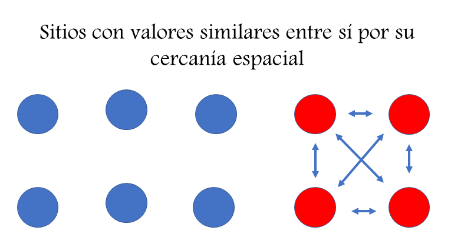
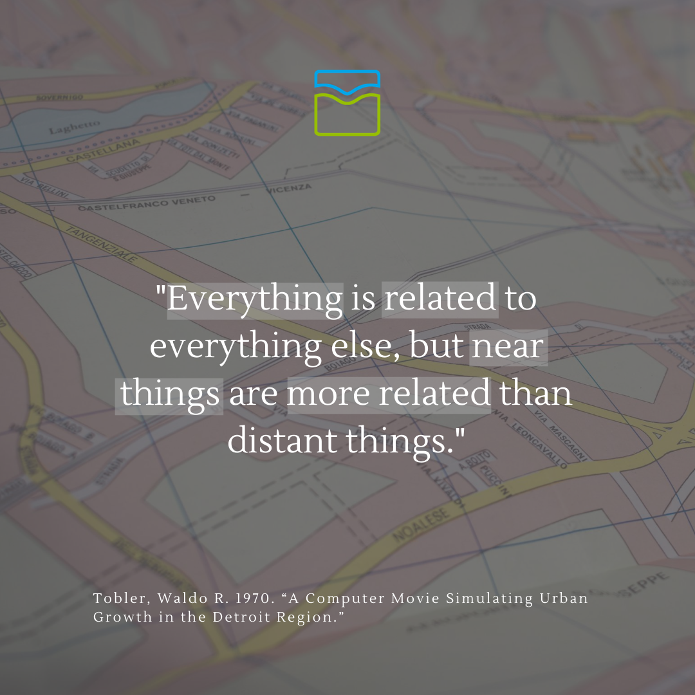
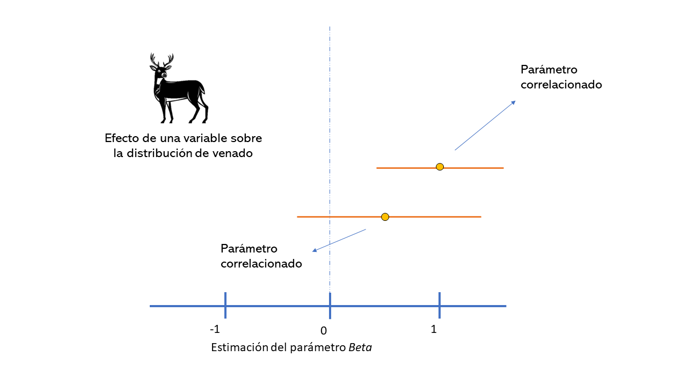
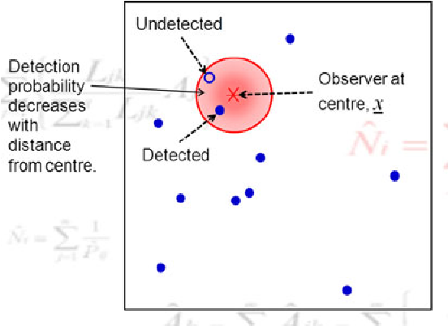
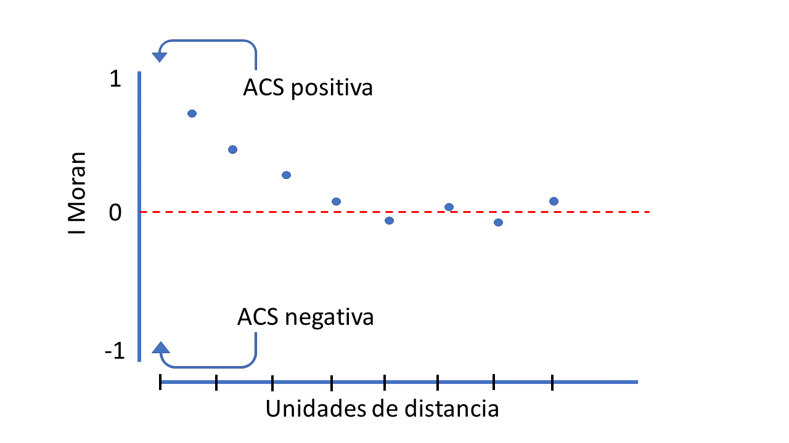
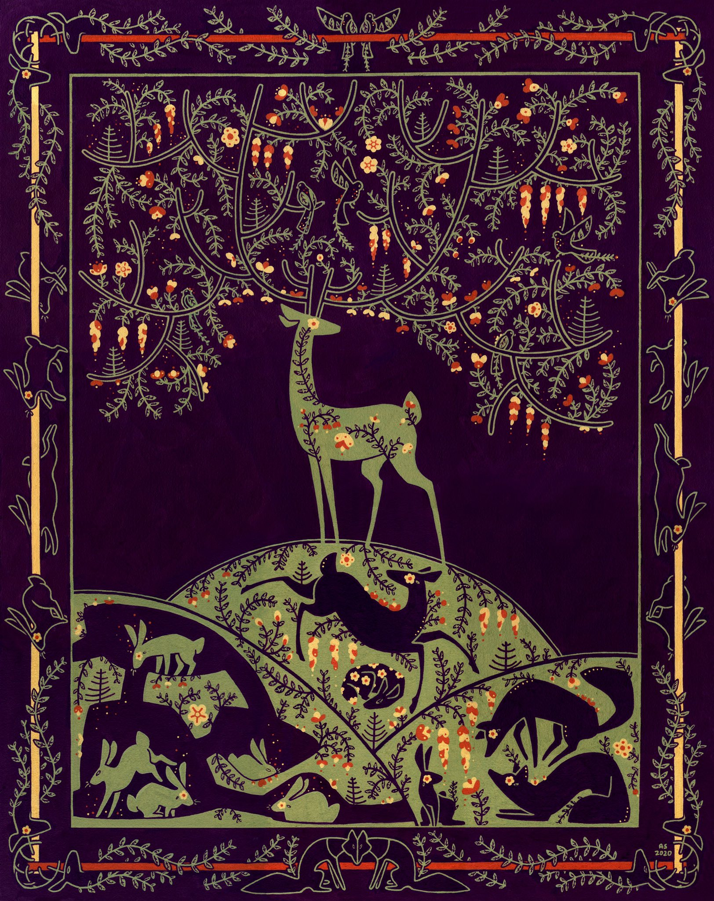

```{r setup, include=FALSE}
library(tidyverse) # Easily Install and Load the 'Tidyverse'
library(sp) # Classes and Methods for Spatial Data
library(sf) # Simple Features for R
library(gghighlight) # Highlight Lines and Points in 'ggplot2'
library(showtext) # Using Fonts More Easily in R Graphs
library(ggtext) # Improved Text Rendering Support for 'ggplot2'
library(ggspatial) # Spatial Data Framework for ggplot2
library(leaflet) # Create Interactive Web Maps with the JavaScript 'Leaflet' Library
library(AICcmodavg) # Model Selection and Multimodel Inference Based on (Q)AIC(c)
library(DHARMa) # Residual Diagnostics for Hierarchical (Multi-Level / Mixed) Regression Models
library(MASS) # Support Functions and Datasets for Venables and Ripley's MASS

# Paquetes para correlogramas
library(pgirmess) # Spatial Analysis and Data Mining for Field Ecologists
library(ncf) # Spatial Covariance Functions

library(xaringanExtra)
library(icon)
library(emo)

font_add_google("Fira Sans", "firasans") # Familia de tipo de letra
showtext_auto()

options(htmltools.dir.version = FALSE)
knitr::opts_chunk$set(
  fig.width=9, fig.height=4, fig.retina=4,
  out.width = "100%",
  cache = FALSE,
  echo = TRUE,
  message = FALSE, 
  warning = FALSE,
  fig.show = TRUE,
  hiline = TRUE,
  root.dir= rprojroot::find_rstudio_root_file()
)

```

```{r xaringan-themer, include=FALSE, warning=FALSE}
library(xaringanthemer)
style_duo_accent(
  primary_color = "#035AA6", 
  #secondary_color = "black",
  header_font_google = google_font("Cabin"),
  #text_font_google   = google_font("Coming Soon", "400", "400i"),
  code_font_google   = google_font("Roboto")
)

#xaringanExtra::use_panelset()
xaringanExtra::use_share_again()
xaringanExtra::style_share_again(
  share_buttons = c("twitter")
)
xaringanExtra::use_tile_view()

```

```{r metathis, echo=FALSE}
library(metathis)
meta() %>%
  meta_name("github-repo" = "gpandradep/ind_spat_fototramp") %>% 
  meta_social(
    title = "Explorando la independencia espacial",
    description = paste(
      "Explorar la autocorrelación espacial en datos provenientes de fototrampeo."
    ),
    url = "https://introindependenciaespacial.netlify.app/",
    image = "https://gpandradep.github.io/ind_spat_fototramp/share-card.png",
    image_alt = paste(
      "Title slide of Explorando la independencia espacial:", 
      "🦌 para datos de fototrampeo 🦨,", 
      "presented by Gabriel Andrade"
    ),
    og_type = "website",
    og_author = "Gabriel Andrade",
    twitter_card_type = "summary_large_image",
    twitter_creator = "@Gatorco_AP",
    twitter_site = "@Gatorco_AP"
  )
```


class: inverse, center, bottom
background-image: url("img/initial.jpg")
background-position: 50% 50%
background-size: cover

#`r rmarkdown::metadata$title`
## `r rmarkdown::metadata$subtitle`
### `r rmarkdown::metadata$author`
[`r icons::fontawesome("twitter")`@Gatorco_AP](https://twitter.com/Gatorco_AP)
[`r icons::fontawesome("github")`@gpandradep](https://github.com/gpandradep)
`r icons::fontawesome("envelope", style = "solid")` gpandradep@gmail.com

---
class: middle, center

# ¿Autocorrelación espacial (ACS)?

En cualquier análisis de información espacial la ACS puede influir sobre nuestros resultados o inferencias. 

**¿Qué es la ACS?**: Correlación de una variable con ella misma, dada cierta distancia espacial. [(Fortin y Dale 2005)](https://doi.org/10.1017/CBO9780511542039).

```{r echo=FALSE, fig.align='center', message=FALSE, warning=FALSE, out.width="50%"}


```

---
class: inverse, center

### Primera ley de la geografía

*Tobler W., (1970) "A computer movie simulating urban growth in the Detroit region". Economic Geography, 46(Supplement): 234–240. *

```{r echo=FALSE, fig.align='center', message=FALSE, warning=FALSE, out.width="40%"}

```

---

## Es muy común en variables ecológicas

.pull-left[

```{r echo=FALSE, message=FALSE, warning=FALSE, out.width="100%"}

```
]
.pull-right[
Muchos de los fenómenos ecológicos dependen de características espaciales resultando en parches o gradientes.
Probablemente, nada funcionaría en los ecosistemas sin la existencia de una estructura espacial. Imagínense un mundo espacialmente homogéneo.
]

---

## ¿ Qué puede causar ACS?

### Los factores más comúnes pueden ser [(Dorman *et al.* 2007)](https://onlinelibrary.wiley.com/doi/10.1111/j.2007.0906-7590.05171.x):
.pull-left[
1- **Procesos biológicos**: especiación, dispersión interacciones ecológicas entre otras, son fenómenos relacionados con el espacio.

2- **Especificación del muestreo**: Distancia de las unidades de muestreo respecto al movimiento de la especie (resolución o grano).

3- **Especificación del modelo**: Relaciones no lineales o modelos que no incluyen una variable ambiental determinante que causa la estructura espacial de la variable de interés.]

.pull-right[

```{r echo=FALSE, message=FALSE, warning=FALSE, out.width="80%", fig.align='center', fig.subcap= "Kachouie, et al. 2020. Association Factor for Identifying Linear and Nonlinear Correlations in Noisy Conditions"}
knitr::include_graphics("https://www.mdpi.com/entropy/entropy-22-00440/article_deploy/html/images/entropy-22-00440-g001.png")
```
]

---

## ¿Por qué importa la indepedencia espacial?

La estructura espacial en las variables ecológicas y ambientales es ubicua. Entonces, ¿Porque molestarnos?

#### En primera medida por consideraciones metodológicas

La mayoría de los test estadísticos asumen independencia de los datos. Uno de los más comunes son los modelos lineales

$$ y_i = \alpha + \beta x_i +\epsilon_i$$

La independencia de este tipo de modelos es asumida en los residuales, ya que se espera que se distribuyan normalmente con media 0 y varianza $\sigma2$. Es decir que, se espera que cada residual no sea dependiente de otro dentro de la misma distribución.

---

## Las consecuencias

#### Error tipo I

El riesgo de inferír patrones significativos donde no los hay.
Por la pseudoreplicación se asumen más grados de libertad de los que hay
Precisión artificial de los Errores e intervalos de confianza de parámetros

```{r fig.align='center', echo=FALSE, message=FALSE, warning=FALSE, out.width="60%"}

```


---

class: inverse, center

## La ACS es ¿mala o buena?

```{r echo=FALSE, message=FALSE, warning=FALSE, out.width= "40%"}
knitr::include_graphics("https://c.tenor.com/EHVGbpNqP2oAAAAd/todo-depende-del-cristal-del-cual-se-mira-tadeo.gif")
```

---
class: inverse, center

## La ACS es ¿ mala o buena ?

.pull-left[
### Buena
Si tu pregunta ecológica se relaciona con el espacio. Entonces la autocorrelación espacial ayudará a informar sobre cómo ocurren los procesos ecológicos en el espacio y a que escala.

```{r echo=FALSE, message=FALSE, warning=FALSE, out.width="50%", fig.align='center', fig.subcap= "https://doi.org/10.1007/s10336-010-0583-z"}

```

]
.pull-right[
### No tan buena

Es un gran problema porque viola el supuesto (de casi todas las pruebas) de independencia. Lo que nos puede llevar a cometer errores  **.white[Tipo I]** o incluso invertir la relación de la pendiente en algunos análisis.

```{r echo=FALSE, message=FALSE, warning=FALSE, out.width= "30%"}

```


]
---

## Detectar y cuantificar la ACS

El primer paso antes de empezar con pruebas o modelos más complejos para lidiar con la ACS, es identificar si es en efecto un problema.
.pull-left[

### Nota
- 1- Si se realizan pruebas que asumen independencia, pero no son regresiones. La ACS debe verificarse en los datos "crudos". Ej. pruebas de t, patrones de actividad, entre otras.

- 2- En regresiones donde se modela el efecto de posibles variables ambientales, la ACS se debe verificar en los residuales.
]
.pull-right[

### Procedimientos

Existen diversos procedimientos, pero los más comunes son la **I de Moran** o correlograma de Moran y los **semi-variogramas**.

Para este ejercicio usaremos los correlogramas de Moran, pero recomiendo que exploren las ventajas que puede ofrecer un semi-variograma.

]
---
### Correlograma de I de Moran

 
$$I= \frac{n}{\sum_{i} \sum_{j}w_{ij}}  \frac{\sum_{i=1}^{n} \sum_{j=1}^{n} w_{i,j}(X_{i}- \overline{X})(X_{j}- \overline{X})} {(X_{i}- \overline{X})^2}$$
donde $n$ es el número de unidades $i$ y $j$; $X$ es la variable de interés; $\overline{X}$ es la media de $X$; y $w_{íj}$ es la matriz de pesos espaciales. El valor de $I$ puede tomar valores de **1** (autocorrelación positiva), **-1** (autocorrelación positiva) o **0** (distribución aleatoria).

.pull-left[
```{r echo=FALSE, message=FALSE, warning=FALSE, fig.align='center', out.height="100%", out.width="700%"}

```
]
.pull-right[ <br>
#### El correlograma es la inspección gráfica de la ACS a las diferentes distancias de pares de puntos de muestreo.]
---

class: inverse, center

## Estudio de caso

Tenemos un muestreo de cámaras trampa en agrupamientos, con una distancia mínima de ~ 500m. Intuitivamente un evaluador te diría que a esta distancia no hay independencia espacial. Particularmente, para especies grandes y que se mueven mucho.


```{r echo=FALSE, message=FALSE, warning=FALSE, out.height="60%", out.width="100%"}

CTtable <- read.csv("Data/CTtable.csv") %>%  # Base de coordenadas de cámaras
 dplyr::select(Station, utm_x, utm_y ) # Seleccionar columnas que usaremos

# Generar objeto espacial para el mapa
CT_points <- SpatialPoints(cbind(CTtable$utm_x, 
                                 CTtable$utm_y),
                           proj4string = CRS('+proj=utm +datum=WGS84 +zone=14 +towgs84=0,0,0')) 

# Proyectar a WGS solo para este paso
CT_points <- spTransform(CT_points, "+proj=longlat +datum=WGS84")

UMA <- st_read("Shape/UMA.shp", quiet= TRUE) # Leer el shape de la UMA
UMA_proj <- st_transform(UMA, "+proj=longlat +datum=WGS84")

# Es importante verificar que este en la misma proyección (CRS)

# Generar el mapa
m <- leaflet() %>%
  addProviderTiles(providers$Esri.WorldImagery, group="Satellite") %>%  # Add satellite data
  addProviderTiles(providers$Esri.WorldTopoMap, group="Base") %>% 
  addCircleMarkers(lng=sp::coordinates(CT_points)[,1], lat=sp::coordinates(CT_points)[,2], 
                   popup= paste(CTtable$Station)) %>%
  addPolygons(lng= st_coordinates(UMA_proj)[,1], lat = st_coordinates(UMA_proj)[,2],
              fillOpacity= 0) %>% 
  # Layers control
  addLayersControl(
    baseGroups = c("Satellite", "Base"),
    options = layersControlOptions(collapsed = FALSE)
  )
m

```

---
## Datos
### Ubicación de cámaras

```{r message=FALSE, warning=FALSE}

CTtable <- read.csv("Data/CTtable.csv") %>%  # Base de coordenadas de cámaras
 dplyr::select(Station, utm_x, utm_y ) # Seleccionar columnas que usaremos
  
```


```{r echo=FALSE, message=FALSE, warning=FALSE}
knitr::kable(head(CTtable))
```


---
### Frecuencia de registro de especies

```{r message=FALSE, warning=FALSE}

freq_reg <- read.csv("Data/surveyReport/events_by_station2.csv") %>% # Datos de registros por estación
  filter(Species == "Odocoileus virginianus") %>% # Filtrar especie
  left_join(CTtable, by= "Station") # Unir con la base da cámaras

```


```{r echo=FALSE}
knitr::kable(head(freq_reg))
```

---
### Registro de eventos por especie

```{r message=FALSE, warning=FALSE}
events_by_species <- read_csv("Data/surveyReport/events_by_species.csv") %>% 
  type.convert(n_events= col_double(), # Convertir tipo de columna
               n_stations= col_double()) %>% # Convertir tipo de columna
  mutate(Sp_n= paste("*",species,"*", " (n= ", n_events, " ) ", sep = "") ) # Columna para los nombres del eje


```

```{r echo=FALSE}
knitr::kable(head(events_by_species))
```


---
## Número de registros

```{r echo=FALSE}
(ndetectionplot <- ggplot(events_by_species, # Datos
                          aes(x= reorder(Sp_n,n_events), #Ordenar sp 
                              y= n_events))+ # No. eventos
    geom_bar(stat= "identity")+  # Geometria
    gghighlight(species %in% c("Odocoileus virginianus"))+ # Señalar venados
    coord_flip()+ # Girar ejes
    labs(title = "Tabla de frecuencia de registro de especies", # Título
      y= "Número de registros independientes", # Eje y
      x= NULL)+ # Sin eje x
    theme_minimal()+ # Tema
    theme(text = element_text(family = 'firasans', size = 16), # tipo de letra
      plot.title.position = 'plot', # Marco de posición
      plot.title = element_text(face = 'bold', # Negrillas 
        margin = margin(t = 2, r = 0, b = 7, l = 0, unit = "mm"), # Margenes
        hjust = 0.5), #posición central
      axis.text.y= element_markdown())) # Itálica nombre de especies

```
---
## Histograma de registros


```{r echo=FALSE}
(hist <- ggplot(freq_reg, aes(x= n_events))+ # Datos
    geom_histogram(binwidth = 3, color= "white")+ # Geometria
    labs(title = " Histograma número de detecciones",
      x= "Número de detecciones",
      y= "Frecuencia") +
    theme_bw()+ # Tema
    theme(text = element_text(family = 'firasans', size = 16), # tipo de letra
          plot.title.position = 'plot', # Marco de posición
          plot.title = element_text(face = 'bold', # Negrillas 
                                    margin = margin(t = 2, r = 0, b = 7, l = 0, unit = "mm"), # Margenes
                                    hjust = 0.5)))

```

---
## Distribución de los registros de 🦌

```{r echo=FALSE, message=FALSE, warning=FALSE}
(map <- ggplot(UMA)+ # shape de uma
  geom_sf()+ # Graficar objeto espacial
  geom_point(data= freq_reg, aes(x=utm_x, y=utm_y, # Agregar puntos
                 size= n_events, color= n_events), # Tamaño y color
             alpha=0.9)+ # Transparencia
  scale_size(range = c(1,20))+ # Escala del radio para los puntos
  labs(title= "Mapa de número detecciones venado cola blanca",
       y= "Lat",
       x= "Lon",
       size= "Número de \ndetecciones",
       color=NULL)+
    annotation_scale(location = "bl", width_hint = 0.5, # Barra de escala
                     line_width=2, tick_height=10) +
    annotation_north_arrow(location = "tr", # Flecha de norte
                           height = unit(2.5, "cm"), width = unit(2.5, "cm"),
                           pad_x = unit(1, "in"), pad_y = unit(0.5, "in"),
                           style = north_arrow_fancy_orienteering)+
  theme_bw()+
    theme(text=element_text(size=15, family = "special"))+
  theme(text = element_text(family = 'firasans', size = 16), # tipo de letra
        plot.title.position = 'plot', # Marco de posición
        plot.title = element_text(face = 'bold', # Negrillas 
                                  margin = margin(t = 2, r = 0, b = 7, l = 0, unit = "mm"), # Margenes
                                  hjust = 0.5)))
```


---
## Modelando la frecuencia de captura del 🦌

```{r message=FALSE, warning=FALSE}

covs.data<-read.csv("Data/covars.csv", header=TRUE) %>% # covariables
  dplyr::select(-X) # eliminar columna X

covs.data$Cluster<- as.character(covs.data$Cluster) # cluster es categórica

### Separar las variables númericas y categóricas
cov.num <- covs.data %>% 
  dplyr::select(where(is.numeric)) %>% # Seleccionar columnas numéricas
  scale() %>%  # estandarizar
  as.data.frame()

cov.fac <- covs.data %>% 
  dplyr::select(where(is.character)) # Seleccionar variables de caracter

sp_glmdata <- data.frame(cov.fac, cov.num) %>% # Unir covariables
  right_join(freq_reg, by= "Station")# Unir con la base de rgistros

```

---
### Así queda nuestra base de datos unida

```{r echo=FALSE, message=FALSE, warning=FALSE}

DT::datatable(
  head(sp_glmdata, 10),
  fillContainer = FALSE, options = list(pageLength = 5)
)

```

---

## Modelando la frecuencia de captura del 🦌
Creamos algunos modelos que reflejan nuestras hipótesis sobre las variables que afectan la frecuencia de captura.

```{r message=FALSE, warning=FALSE}
# Modelos lineales generalizados simples

# sin variables
m0 <- glm(n_events~ 1, data = sp_glmdata, family = "poisson")

# la frecuencia de registro afectada por la distancia a cultivo
m1 <- glm(n_events~ Dcrops, data = sp_glmdata, family = "poisson")

# la frecuencia de registro afectada por el verdor de la vegetación
m2 <- glm(n_events~ MSAVI, data = sp_glmdata, family = "poisson")

# la frecuencia de registro afectada por la pendiente
m3 <- glm(n_events~ Slope, data = sp_glmdata, family = "poisson") 
          
# la frecuencia de registro afectada por la distancia a poblados
m4 <- glm(n_events~ Dpop_G, data = sp_glmdata, family = "poisson")

# la frecuencia de registro afectada por el tipo de habitat
m5 <- glm(n_events~ Habitat, data = sp_glmdata, family = "poisson" )
```
---

## Modelando la frecuencia de captura del 🦌

Según el criterio de información de AIC nuestro mejor modelo es aquel que incluye el hábitat.
```{r echo=FALSE, message=FALSE, warning=FALSE}
lista_mods <- list(m0, m1, m2, m3, m4, m5)
mod_names <- c("freq~ 1",
               "freq~ D_cultivos",
               "freq~ MSAVI",
               "freq~ Slope",
               "freq~ D_poblado",
               "freq~ Habitat"
               )

AIC <- aictab(lista_mods, modnames = mod_names, second.ord = F, sort = T)
knitr::kable(AIC, 'html', digits = 3)

```
---
## Procedemos a inspeccionar el modelo

Debido al carácter relativo del AIC es necesario verificar que el mejor modelo es un buen modelo. Un mal ajuste puede ser causado por la existencia de autocorrelación en los residuales.
.pull-left[

```{r message=FALSE, warning=FALSE}
# Debido a que para glm poisson los residuales no se definen directamente, 
#usamos simulateResiduals del paquete DHARMa
residuales <- simulateResiduals(fittedModel = m5, plot =F)

```


```{r fig.align='center', warning=FALSE, out.height="100%", out.width="70%",  eval=FALSE}
# Verificamos visualmente que el modelo cumpla los requisitos de la distribución
plotQQunif(residuales)
```
]
.pull-right[
```{r echo=FALSE, fig.align='center', warning=FALSE}
# Verificamos visualmente que el modelo cumpla los requisitos de la distribución
plotQQunif(residuales)
```

]
---
## Mapa de los residuales

```{r echo=FALSE, out.height="200%", out.width="100%"}
# Creamos el data.frame para el correlograma
data_resm5 <- data.frame(res=residuals(residuales), # Residuales que creamos
                         x= sp_glmdata$utm_x,# coordenadas en x
                         y= sp_glmdata$utm_y) # coordenadas en y

(map_res <- ggplot(UMA)+ # shape de uma
    geom_sf()+ # Graficar objeto espacial
    geom_point(data= data_resm5, aes(x=x, y=y, # Agregar puntos
                                   size= res, color= res), # Tamaño y color
               alpha=0.9)+ # Transparencia
    scale_size(range = c(1,15))+ # Escala del radio para los puntos
    labs(title= "Mapa de residuales modelo m5",
         y= "Lat",
         x= "Lon",
         size= "Número de \ndetecciones",
         color=NULL)+
    annotation_scale(location = "bl", width_hint = 0.5, # Barra de escala
                     line_width=2, tick_height=10) +
    annotation_north_arrow(location = "tr", # Flecha de norte
                           height = unit(2.5, "cm"), width = unit(2.5, "cm"),
                           pad_x = unit(1, "in"), pad_y = unit(0.5, "in"),
                           style = north_arrow_fancy_orienteering)+
    theme_bw()+
    theme(text=element_text(size=15, family = "special"))+
    theme(text = element_text(family = 'firasans', size = 16), # tipo de letra
          plot.title.position = 'plot', # Marco de posición
          plot.title = element_text(face = 'bold', # Negrillas 
                                    margin = margin(t = 2, r = 0, b = 7, l = 0, unit = "mm"), # Margenes
                                    hjust = 0.5)))

```


---
class: inverse, center

# ¿Será esta desviación del ajuste causada por la autocorrelación espacial?

```{r echo=FALSE, message=FALSE, warning=FALSE, fig.align='center', out.height="40%", out.width="40%"}
knitr::include_graphics("https://c.tenor.com/n7Q-cdm8ZLkAAAAd/suspicious-fry-futurama.gif")
```


---

class: inverse, middle, center

.pull-left[
# Verifiquemos si existe autocorrelación espacial

.footnote[image by [Abigail Spence](https://abigailspenceart.com/)]

]

.pull-right[
```{r fig.align='center', echo=FALSE, message=FALSE, warning=FALSE, out.width="100%"}

```
]

---

## Exploremos si existe autocorrelación espacial

Usaremos correlogramas espaciales para verificar si existe autocorrelación espacial
Primero vamos a generar la matriz de distancia. Para asegurar que cada categoría de distancia tenga suficientes pares se recomienda trabajar con 2/3 de la máxima distancia. En este caso la máxima distancia es ~ 8km

```{r}
Wdist <- data.frame(x= sp_glmdata$utm_x,
                    y= sp_glmdata$utm_y) %>% 
  dist() %>% 
  as.matrix()
maxd <- 2/3* max(Wdist)
maxd
```

---

# Paquete  `pgirmess`
`pgirmess` llama las funciones de `spdep` con una sintaxis mas amigable. Esto también hace que sea menos flexible. Esta aproximación asume que la variable de respuesta se distribuye de manera normal para calcular los p valores

```{r message=FALSE, warning=FALSE}
pgirmess_correg <- pgirmess::correlog(coords = cbind(data_resm5$x, # coordenada x
                                                     data_resm5$y), # coordenada y
                                      z= data_resm5$res, # residuales
                                      method = "Moran", # Tipo demétodo
                                      nbclass = NULL) # Automáticamente el número de pares
```

---

# Paquete `ncf`
La ventaja del paquete `ncf` es que permite generar correlogramas usando un test de significancia no paramétrico, por medio simulaciones monte Carlo

```{r message=FALSE, warning=FALSE}
ncf_correg <- ncf::correlog(x=data_resm5$x, # coordenadas en x
                            y=data_resm5$y, # coordenadas en y
                            z=data_resm5$res, # variable de interés,
                            latlon =  FALSE,
                            na.rm=T, # en caso de NAs
                            increment = 700, # Distancia mínima de unidades
                            resamp=500)
```

---
### Modificamos los data set para grraficar las dos aproximaciones en conjutno

```{r message=FALSE, warning=FALSE}
corbase <- data.frame(coef=ncf_correg$correlation, 
                     dist.class= ncf_correg$mean.of.class, 
                     p.value= ncf_correg$p,
                     n= ncf_correg$n )%>% 
  bind_rows(as.data.frame(pgirmess_correg)) %>% 
  mutate(package= c(rep("ncf", 12), rep("pgirmess",12)),
         p_valor= if_else(p.value<0.025, "significativo", "no-significativo"))
```

```{r echo=FALSE, message=FALSE, warning=FALSE}
DT::datatable(
  head(corbase, 10),
  fillContainer = FALSE, options = list(pageLength = 5)
)
```

---

class: center

## El correlograma

.pull-left[
```{r message=FALSE, warning=FALSE, eval=FALSE}
(ggplot(corbase ,aes(x=dist.class, y=coef, group= package))+
    geom_hline(yintercept = 0, linetype= "dashed")+
    geom_line(size=0.9, colour="black")+
    geom_point(aes(fill= package, shape=p_valor), 
               shape= 21, size=5, stroke = 1.5)+
    ylim(-1,1)+
    scale_x_continuous(breaks = seq(0,8000, by=500),limits = c(500,6000))+
    labs(x= "Unidades de distancia (m)", y= " Moran I", 
         title = " Correlograma de residuales",
         colour= "Librería")+
    theme_classic()+
    theme(text = element_text(family = 'firasans', size = 20), # tipo de letra
          plot.title.position = 'plot', # Marco de posición
          plot.title = element_text(face = 'bold', # Negrillas 
                                    margin = margin(t = 2, r = 0, 
                                                    b = 7, l = 0, 
                                                    unit = "mm"), # Margenes
                                    hjust = 0.5),
          legend.position = c(0.8, 0.8))) # posición de la legenda
```

]
.pull-right[

```{r echo=FALSE, message=FALSE, warning=FALSE}
(ggplot(corbase ,aes(x=dist.class, y=coef, group= package))+
    geom_hline(yintercept = 0, linetype= "dashed")+
    geom_line(size=0.9, colour="black")+
    geom_point(aes(fill= package, shape=p_valor), 
               shape= 21, size=5, stroke = 1.5)+
    ylim(-1,1)+
    scale_x_continuous(breaks = seq(0,8000, by=500),limits = c(500,6000))+
    labs(x= "Unidades de distancia (m)", y= " Moran I", 
         title = " Correlograma de residuales",
         colour= "Librería")+
    theme_classic()+
    theme(text = element_text(family = 'firasans', size = 20), # tipo de letra
          plot.title.position = 'plot', # Marco de posición
          plot.title = element_text(face = 'bold', # Negrillas 
                                    margin = margin(t = 2, r = 0, 
                                                    b = 7, l = 0, 
                                                    unit = "mm"), # Margenes
                                    hjust = 0.5),
          legend.position = c(0.8, 0.8))) # posición de la legenda
```

]

---
## SPline
`ncf` también permite ajustar splines cubicas por medio de bootstrap, en este caso no es necesario definir cortes de pares de distancias y permite obtener intervalos de confianza
.pull-left[
```{r message=FALSE, warning=FALSE}
spline <- ncf::spline.correlog(x=data_resm5$x, # coordenadas en x
                               y=data_resm5$y, # coordenadas en y
                               z=data_resm5$res,
                               xmax = maxd,
                               type = "boot",
                               resamp = 500)

```

]

.pull-right[

```{r}
plot(spline)
```

]

---
class: inverse

## La autocorrelación espacial no es el problema

Lo que podemos concluir con todas las aproximaciones vistas es que parece ser que no hay una autocorrelación espacial fuerte de los residuales de nuestro modelo m5. Esto quiere decir que las desviaciones de la normalidad se deben a otro factor.

Ajustamos otro modelo que asumen una distribución de error *binomial negativa*. Con ello nos damos cuenta que el problema era el tipo de distribución.
```{r message=FALSE, warning=FALSE}
m5bn <- glm.nb(n_events~ Habitat, data = sp_glmdata)

residuales.bn <- simulateResiduals(fittedModel = m5bn, plot =F)

```
---
class: inverse

## La autocorrelación espacial no es el problema
```{r echo=FALSE, message=FALSE, warning=FALSE}
plotQQunif(residuales.bn)
```
---
class: inverse, center, midle

# Esto apenas es el comienzo
###Esto fue un ejercicio sencillo, pero lidiar con la ACS merece realizar diversas lecturas en el tema, conocer los supuestos de las técnicas y aprender a interpretar los resultados.

###En caso de encontrar ACS y dependiendo de los objetivos es recomendable usar herramientas como modelos de mínimos cuadrados generalizados (GLS), modelos mixtos, considerar a las coordenadas como covariables o modelos autorregresivos. 


---
class: center

### Aun no estas listo para enfrentarte a la ACS en la vida real, así que te recomiendo leer:

.pull-left[
-   1- [Fox \*et al.\* 2015. Ecological Statistics: Contemporary theory and application](https://oxford.universitypressscholarship.com/view/10.1093/acprof:oso/9780199672547.001.0001/acprof-9780199672547)

-   2- [Plant 2019. Spatial Data Analysis in Ecology and Agriculture Using R](https://www.routledge.com/Spatial-Data-Analysis-in-Ecology-and-Agriculture-Using-R/Plant/p/book/9780367732325)

-   3- [Dorman \*et al.\* 2007. Methods to account for spatial autocorrelation in the analysis of species distributional data: a review](https://onlinelibrary.wiley.com/doi/10.1111/j.2007.0906-7590.05171.x)

-   4- [Kuhn & Dorman 2012. Less than eight (and a half) misconceptions of spatial analysis](https://onlinelibrary.wiley.com/doi/full/10.1111/j.1365-2699.2012.02707.x)

-   5- [Fletcher & Fortin 2018. Spatial Ecology and Conservation](https://link.springer.com/book/10.1007/978-3-030-01989-1)
]

.pull-right[
```{r echo=FALSE, message=FALSE, warning=FALSE}
knitr::include_graphics("https://d23gn3985hkc32.cloudfront.net/wp-content/uploads/2020/12/252164-DangerousToGoAlone.jpg")

```
]
---
class: inverse
background-image: url("img/end.JPG")
background-position: 50% 50%
background-size: cover

## Gracias

